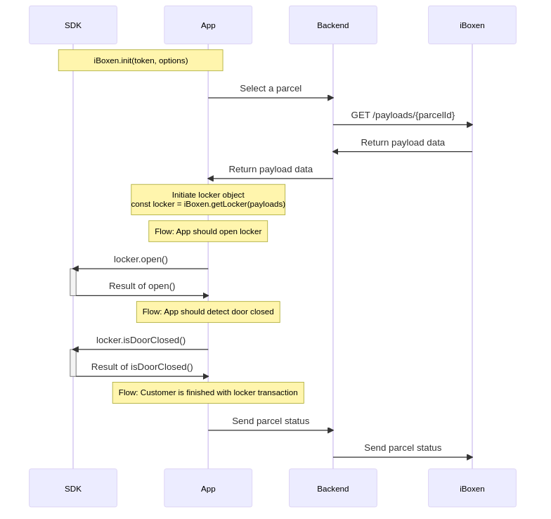

# React Native implementation



## Install 

`npm install @iboxen/react-native-sdk`

## Sample app

```tsx
import iBoxen from '@iboxen/react-native-sdk';
import React, { useEffect, useState } from 'react';
import {
  Button,
  SafeAreaView,
  ScrollView,
  Platform,
  PermissionsAndroid
} from 'react-native';

const TOKEN = "" // JWT
const ENV = "staging" // "production" | "staging"

iBoxen.init(TOKEN, { env: ENV })

import PAYLOADS from '../PAYLOADS' // from your backend

function App(): JSX.Element {
  const [locker, setLocker] = useState()

  useEffect(() => {
    Platform.OS === 'android' &&
      PermissionsAndroid.requestMultiple([
        PermissionsAndroid.PERMISSIONS.BLUETOOTH_SCAN!,
        PermissionsAndroid.PERMISSIONS.BLUETOOTH_CONNECT!,
        PermissionsAndroid.PERMISSIONS.ACCESS_COARSE_LOCATION!,
        PermissionsAndroid.PERMISSIONS.ACCESS_FINE_LOCATION!,
      ]);

    iBoxen.initBluetooth()

    setLocker(iBoxen.getLocker(PAYLOADS))
  }, [])

  return (
    <SafeAreaView>
      <ScrollView>
        <Button
          onPress={() => locker.open()}
          title="open"
          color="#841584"
        />
        <Button
          onPress={() => locker.isDoorClosed()}
          title="isDoorClosed"
          color="#841584"
        />
      </ScrollView>
    </SafeAreaView>
  );
}

export default App;


---


Initiate iBoxen SDK

`iBoxen.init(JWT, { env: <environment>, logger: <implementation of SDKLogger>, serviceId: <supplied service id> })`

<br/>
Initiate iBoxen Bluetooth, required to be able to interact with the bluetooth-functionality

`void initBluetooth()`

<br/>

Get nearby peripherals

`Promise<String[]> iBoxen.getPeripherals()`

<br/>

Connect to peripheral

`Promise<boolean> iBoxen.connect(String: peripheralName)`

<br/>

Disconnect from all peripherals

`Primise iBoxen.disconnect()`

<br/>
Get locker instance from payloads

`const locker = iBoxen.getLocker(payloads)`

<br/>
Open locker

`Promise locker.open()`

<br/>
Detect locker door closed

`Promise<boolean> locker.isDoorClosed()`


### Errors
All SDK-interaction promises can throw the following errors:

- "[iBoxenSDK] Bluetooth is not enabled"
- "[iBoxenSDK] SDK bluetooth is not initialized" (iBoxen.initBluetooth needs to be called)
- "[iBoxenSDK] Missing required permissions: android.permission.BLUETOOTH_SCAN, android.permission.BLUETOOTH_CONNECT"