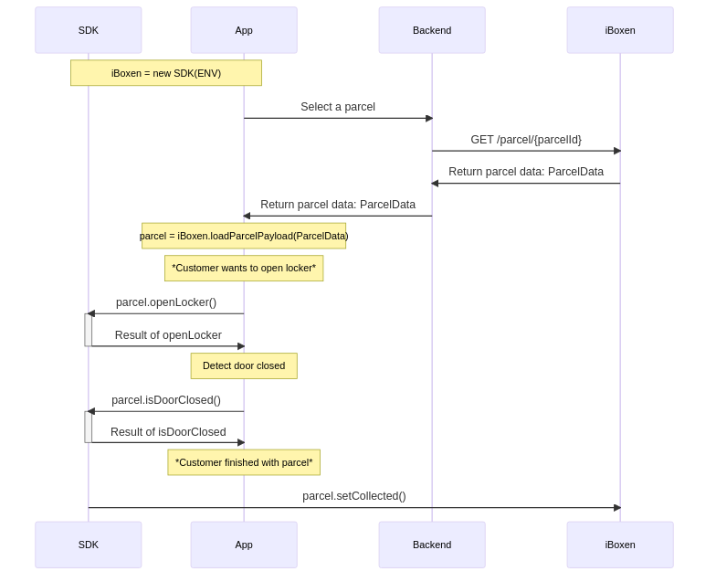

# 1.0.1

### Binaries
- [android-release.aar](./android-release.aar)
- [iOS](./ios)

### Installation
- ReactNative: npm install @iboxen/react-native-sdk

## Flow charts
Only applicable for the Native implementations of the SDK, not ReactNative

**Open locker**




&nbsp;
# Examples

## Native
**Create instance of SDK**
```java
import com.qlocxiboxen.sdk.*;
BluetoothAdapter mBluetoothAdapter;
BluetoothManager mBluetoothManager;

Context mContext;
QlocxLogger mLogger = new QlocxLogger(mContext);

QlocxInterface mQlocxInterface = new QlocxInterface(mBluetoothAdapter, mBluetoothManager, mLogger);
```

**Get nearby locker BLE names**

These names can later be used to query iBoxen system for further information
```java
boolean shouldCleanCache = false;
mQlocxInterface.GetPeripherals(shouldCleanCache, new QlocxInterface.PeripheralScanCallback() {
    @Override
    public void result(ArrayList <String> deviceNames) {}

    @Override
    public void deviceResult(ArrayList <BluetoothDevice> devices) {}
});
```

**Send payload to locker**

```java
// payload is an encrypted hex string
String payload = "cc388cd03aed9e65917cad745dd755955328ed212c725ae804bed85fc";

// the generic object is passed back in the callback, can be any that the implementator chooses
Object genericObject = new Object();

mQlocxInterface.sendSequencePayload(payload, 2500, genericObject, 0, new QlocxInterface.SequenceCallback() {
    // returnObject is the same as genericObject above
    @Override
    public void result(byte[] result, Object returnObject) {}

    @Override
    public void error(QlocxException exception, Object returnObject) {}
});
```

---

## React Native

```tsx
import iBoxen, { Parcel } from "@iboxen/react-native-sdk";

const TOKEN = "" // JWT
const ENV = "production" // "production" | "staging"

// instantiate a new consumer object
const iBoxenInterface = new iBoxen(TOKEN, ENV) 

const App = () => {
  const [parcel, setParcel] = useState<Parcel>(null)

  useEffect(() => {
    // get parcel
    iBoxenInterface.getParcel("1Z8E444V0497700608").then(setParcel)
  }, [])

  return (
    <View key={parcel._id}>
      <Text>{parcel.parcelId}</Text>
      <Button title="Open locker" onPress={parcel.openLocker} />
      <Button title="Sense door closed" onPress={parcel.isDoorClosed} />
      <Button title="Set status collected" onPress={parcel.setCollected} />
    </View>
  )
}
```
---
&nbsp;

`iBoxen new iBoxen(jwt token, environment)`

Constructing a new iBoxen consumer object used for interacting with iBoxen system.

`void initBluetooth()`

Initiate Bluetooth

`Promise iBoxen.getParcel(parcelId)`

Get parcel payload

`Promise iBoxen.loadParcelPayload(paylaod)`
Load parcel payload

`Promise parcel.openLocker()`

Open the parcel's locker


`Promise parcel.isDoorClosed()`

Check if the parcel's locker door has been closed

`Promise parcel.setCollected()`

Set parcel as collected, deleting the user's digital key

&nbsp;

---
&nbsp;

## Requirements

### Android
Requires the app to have the following permissions in manifest & allowed by user:

```xml   
<uses-permission android:name="android.permission.INTERNET" />
<uses-permission android:name="android.permission.CAMERA" />
<uses-permission android:name="android.permission.INTERNET" />
<uses-permission android:name="android.permission.BLUETOOTH"/>
<uses-permission android:name="android.permission.BLUETOOTH_SCAN"/>
<uses-permission android:name="android.permission.BLUETOOTH_CONNECT"/>
<uses-permission android:name="android.permission.BLUETOOTH_ADMIN"/>
<uses-permission android:name="android.permission.ACCESS_FINE_LOCATION" />
<uses-permission android:name="android.permission.ACCESS_COARSE_LOCATION" />
```

Also location services enabled. Example Java code:
```java
public Boolean locationServicesEnabled() {
    LocationManager locationManager = (LocationManager) ctx.getSystemService(Context.LOCATION_SERVICE);

    Boolean enabled = locationManager.isProviderEnabled(LocationManager.GPS_PROVIDER);

    return enabled;
}
```

Check if Android Bluetooth is enabled. Examble Java code:

```java
public Boolen bluetoothEnabled() {
    BluetoothAdapter mBluetoothAdapter;
    BluetoothManager mBluetoothManager = (BluetoothManager) ctx.getSystemService(ctx.BLUETOOTH_SERVICE);

    mBluetoothAdapter = (BluetoothAdapter) mBluetoothManager.getAdapter();

    return mBluetoothAdapter.isEnabled();
}
```

### iOS 

### Version changes & compatibility
