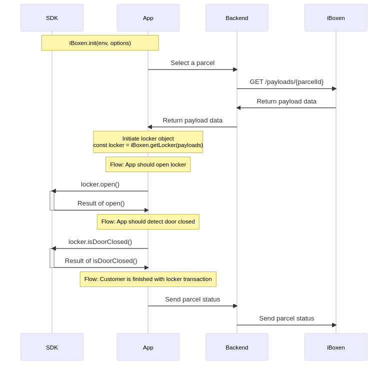

# React Native implementation




```tsx
import iBoxen from '@iboxen/react-native-sdk';

const TOKEN = "" // JWT
const ENV = "staging" // "production" | "staging"

iBoxen.init(TOKEN, { env: ENV })

// instantiate a new iboxen object
const App = () => {
  const [locker, setLocker] = useState<Parcel>(null)
  
  useEffect(() => {
    // initiate iBoxen bluetooth
    await iBoxen.initBluetooth()

    // get payloads from backend
    const payloads = await fetch()

    // get iBoxen locker
    const locker = iBoxen.getLocker(payloads)
    setLocker(locker)

    // if successful parcel delivery, send status till iBoxen backend
  }, [])

  const isDoorClosed = () => {
    if (await locker.isDoorClosed()) {
      // OPEN!
    }
  }

  return (
    <View>
      <Button title="Open locker" onPress={locker.open} />
      <Button title="Sense door closed" onPress={isDoorClosed} />
    </View>
  )
}
```
---
&nbsp;

```ts
class SDKLogger extends iBoxenLogger {
  private logLevelTranslation = {
    [iBoxenLoggerLogLevel.DEBUG]: LogLevel.Debug,
    [iBoxenLoggerLogLevel.ERROR]: LogLevel.Error,
    [iBoxenLoggerLogLevel.INFO]: LogLevel.Info,
    [iBoxenLoggerLogLevel.WARN]: LogLevel.Warning,
  }

  print(level: iBoxenLoggerLogLevel, ...messages: any[]): void {
      if (this.logLevelTranslation[level]) {
        // do logging
      }
  }
}
```

---
&nbsp;

Initiate iBoxen SDK

`iBoxen.init(JWT, { env: <environment>, logger: <implementation of SDKLogger> })`

<br/>
Initiate iBoxen Bluetooth

`void initBluetooth()`

<br/>
Create locker object

`const locker = iBoxen.getLocker(payloads)`

<br/>
Open locker

`Promise locker.open()`

<br/>
Detect locker door closed

`Promise: boolean locker.isDoorClosed()`
